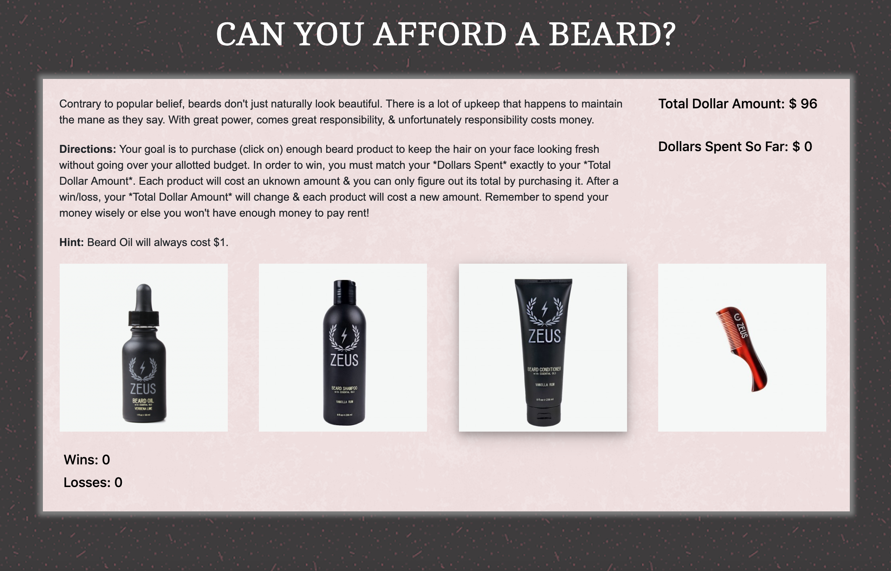
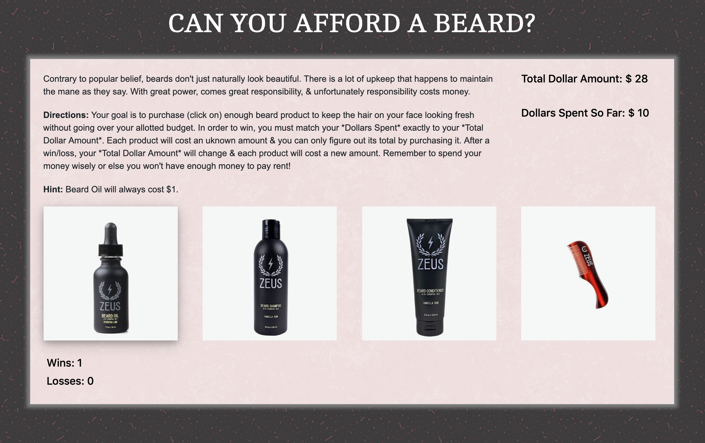
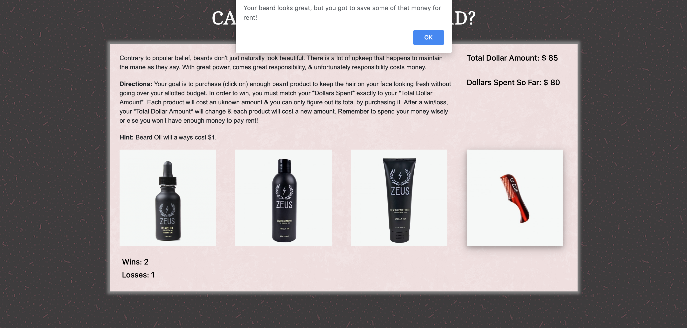

This is my submission for homework assignment number four: jQuery Assignment. We were tasked with creating a game in which the user must click on an image and match their total score with the randomly generated number they are given at the beginning of each game. Each of these images are assigned a numerical value between 1-12 which are only revealed upon the user clicking them. The user registers a win if they correctly match the randomly generated number or are given a loss if they exceed the randomly generated number. Once a win or loss is registered, the game resets and the user is given a new randomly generated number. In order to accomplish this, we had to use our recent understanding of jQuery, JavaScript, Bootstrap, HTML, & CSS.

Directions for "Can You Afford A Beard":

Your goal is to purchase (click on) enough beard product to keep the hair on your face looking fresh without going over your allotted budget. In order to win, you must match your *Dollars Spent* exactly to your *Total Dollar Amount*. Each product will cost an uknown amount & you can only figure out its total by purchasing it. After a win/loss, your *Total Dollar Amount* will change & each product will cost a new amount. Remember to spend your money wisely or else you won't have enough money to pay rent!

Tech I Used:

[HTML](https://www.w3schools.com/html/)

[Bootstrap](https://getbootstrap.com/docs/4.3/getting-started/introduction/)

[CSS](https://www.w3schools.com/css/)

[JavaScript](https://www.w3schools.com/js/)

[jQuery](https://www.w3schools.com/jquery/)

Author: [Matthew Hagarty](https://github.com/matthewryanhagarty)